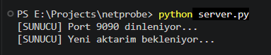
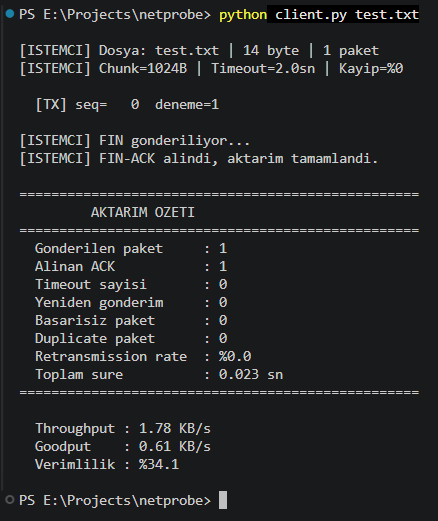
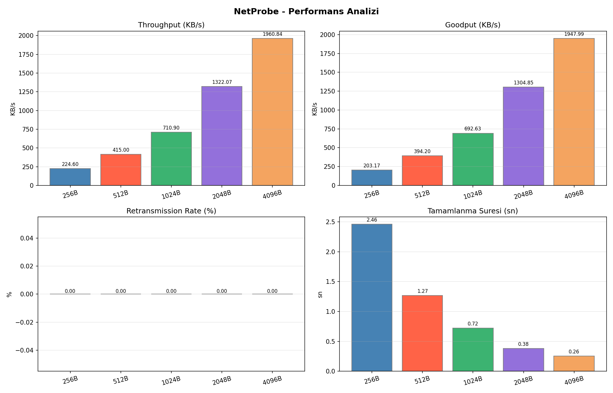
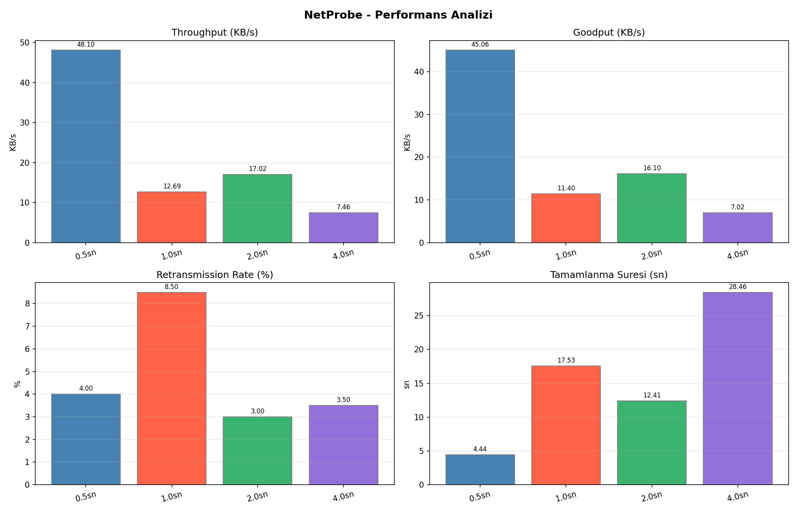
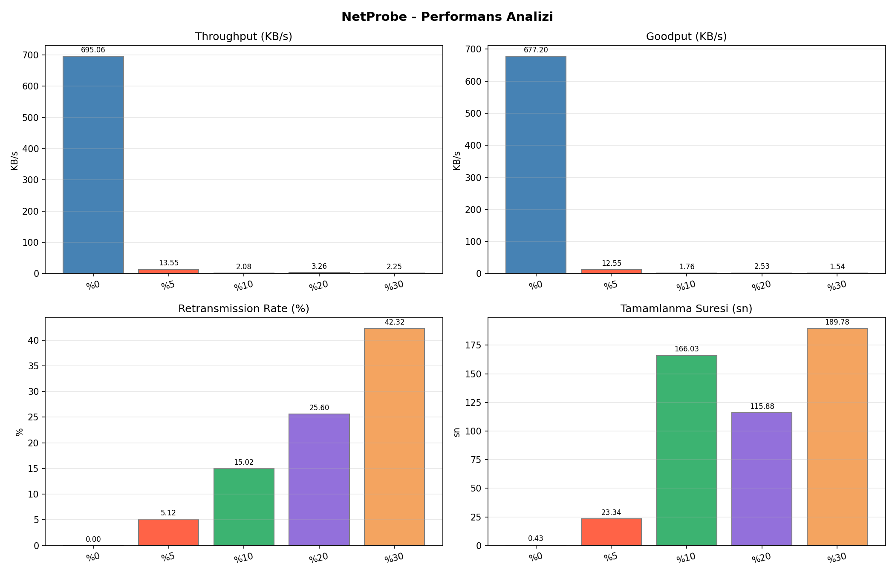
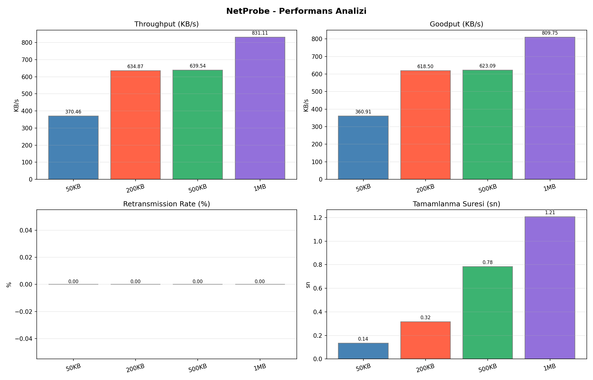

# NetProbe

<<<<<<< HEAD
UDP Tabanlı Güvenilir Dosya Aktarımı, Trafik İzleme ve Ağ Performans Analiz Platformu

---

## İçindekiler

* Proje Hakkında
* Özellikler
* Sistem Mimarisi
* Proje Yapısı
* Kullanılan Teknolojiler
* Kurulum
* Kullanım
* Deney Senaryoları
* Performans Analizi
* Ekran Görüntüleri
* Proje Ekibi
* Lisans

---

## Proje Hakkında

NetProbe, Bursa Teknik Üniversitesi Bilgisayar Mühendisliği Bölümü Bilgisayar Ağları dersi kapsamında geliştirilmiş UDP tabanlı güvenilir dosya aktarım sistemidir.

UDP protokolü doğası gereği güvenilir veri aktarımı sağlamamaktadır. Bu proje kapsamında güvenilirlik mekanizmaları uygulama katmanında yeniden tasarlanmış ve geliştirilmiştir.

Sistem;

* Dosyaları paketlere böler,
* Sequence Number kullanır,
* ACK mekanizması uygular,
* Timeout kontrolü yapar,
* Kayıp paketleri yeniden gönderir,
* Duplicate paketleri yönetir,
* Dosya bütünlüğünü doğrular,
* Ağ performansını analiz eder,
* Deneysel sonuçları grafiklerle raporlar.

---

## Özellikler

### Güvenilir UDP Aktarımı

* Stop-and-Wait ARQ mekanizması
* Sequence Number desteği
* ACK doğrulaması
* Timeout yönetimi
* Retransmission desteği
* Duplicate paket kontrolü
* Dosya yeniden birleştirme

### Bütünlük Doğrulama

* Paket seviyesinde MD5 Checksum
* Dosya seviyesinde SHA256 Hash

### Trafik İzleme

* Gönderilen paket sayısı
* ACK sayısı
* Timeout sayısı
* Retransmission sayısı
* Başarısız paket sayısı
* Toplam aktarım süresi

### Performans Analizi

* Throughput
* Goodput
* Completion Time
* Retransmission Rate

### Ağ Simülasyonu

* Yapay paket kaybı
* Yapay gecikme
* Farklı ağ koşullarında test desteği

---

## Sistem Mimarisi

```text
+-------------+
|   Client    |
+-------------+
       |
       | UDP
       |
       v
+--------------------+
| Reliable Protocol  |
| Sequence Number    |
| ACK                |
| Timeout            |
| Retransmission     |
+--------------------+
       |
       v
+-------------+
|   Server    |
+-------------+
       |
       v
+-------------+
| File System |
+-------------+
```

---

## Proje Yapısı

```text
NETPROBE
│
├── logs/
│
├── received/
│   └── alinan_dosya
│
├── results/
│   ├── senaryo1/
│   ├── senaryo2/
│   ├── senaryo3/
│   └── senaryo4/
│
├── test_files/
│
├── analyzer.py
├── client.py
├── logger.py
├── network_sim.py
├── protocol.py
├── run_experiments.py
├── server.py
└── test.txt
```

---

## Kullanılan Teknolojiler

| Teknoloji              | Amaç                |
| ---------------------- | ------------------- |
| Python                 | Uygulama geliştirme |
| UDP Socket Programming | Ağ iletişimi        |
| hashlib                | Hash hesaplama      |
| struct                 | Paket oluşturma     |
| CSV                    | Loglama             |
| JSON                   | Sonuç kayıtları     |
| Matplotlib             | Grafik üretimi      |

---

## Kurulum

Projeyi klonlayın:

```bash
git clone https://github.com/kullaniciadi/netprobe.git
cd netprobe
```

Gerekli bağımlılıkları yükleyin:

```bash
pip install matplotlib
```

---

## Kullanım

### Sunucuyu Başlat

```bash
python server.py
```

### Dosya Gönder

```bash
python client.py test.txt
```

### Deney Senaryolarını Çalıştır

```bash
python run_experiments.py
```

---

## Deney Senaryoları

### Senaryo 1

Farklı paket boyutlarının performansa etkisi

* 256 Byte
* 512 Byte
* 1024 Byte
* 2048 Byte
* 4096 Byte

### Senaryo 2

Farklı timeout sürelerinin performansa etkisi

* 0.5 sn
* 1 sn
* 2 sn
* 4 sn

### Senaryo 3

Farklı paket kayıp oranlarının performansa etkisi

* %0
* %5
* %10
* %20
* %30

### Senaryo 4

Farklı dosya boyutlarının performansa etkisi

* 50 KB
* 200 KB
* 500 KB
* 1 MB

---

## Performans Analizi

Gerçekleştirilen deneylerde aşağıdaki metrikler ölçülmüştür:

* Throughput
* Goodput
* Completion Time
* Retransmission Rate

Sonuçlar `results/` klasöründe grafik ve JSON formatında saklanmaktadır.

---

## Ekran Görüntüleri

### Sunucu Çalışırken



### İstemci Çalışırken



### Senaryo 1



### Senaryo 2



### Senaryo 3



### Senaryo 4



---

## Proje Ekibi

| İsim      | GitHub                                          |
| --------- | ----------------------------------------------- |
| Büşra Yesin | [GitHub Profili](https://github.com/busrayesinn) |
| Melike Dal | [GitHub Profili](https://github.com/melikedal) |
| İsmihan Kırmızıoğlan | [GitHub Profili](https://github.com/ismihankrmz) |

---

## Akademik Bilgi

Bursa Teknik Üniversitesi

Mühendislik ve Doğa Bilimleri Fakültesi

Bilgisayar Mühendisliği Bölümü

Bilgisayar Ağları Dersi

Dönem Projesi

2025-2026

---

## Lisans

Bu proje eğitim amaçlı geliştirilmiştir.
=======
UDP Tabanli Guvenilir Dosya Aktarimi, Trafik Izleme ve Ag Performans Analiz Platformu

Bursa Teknik Universitesi - Bilgisayar Aglari Dersi Donem Projesi

## GitHub

https://github.com/netprobe-btu/NetProbe

## Proje Yapisi

netprobe/

├── protocol.py          # Paket yapisi, pack/unpack, checksum

├── logger.py            # Olay kayit sistemi (CSV)

├── server.py            # UDP sunucu

├── client.py            # UDP istemci (stop-and-wait)

├── network_sim.py       # Yapay kayip/gecikme simulatoru

├── analyzer.py          # Performans metrikleri ve grafikler

├── run_experiments.py   # 4 deney senaryosu

## Kurulum

pip install matplotlib

## Calistirma

Terminal 1:
python server.py

Terminal 2:
python client.py dosya.txt

Deneyler:
python run_experiments.py

## Grup

- Ismihan Kirmizioglan - 23360859078
- Busra Yesin - 23360859076
- Melike Dal - 22360859017

## Danisman

Dr. Izzet Fatih Senturk
>>>>>>> d92f8aebbda641df2445eb2c4df21c2fc2a80692
